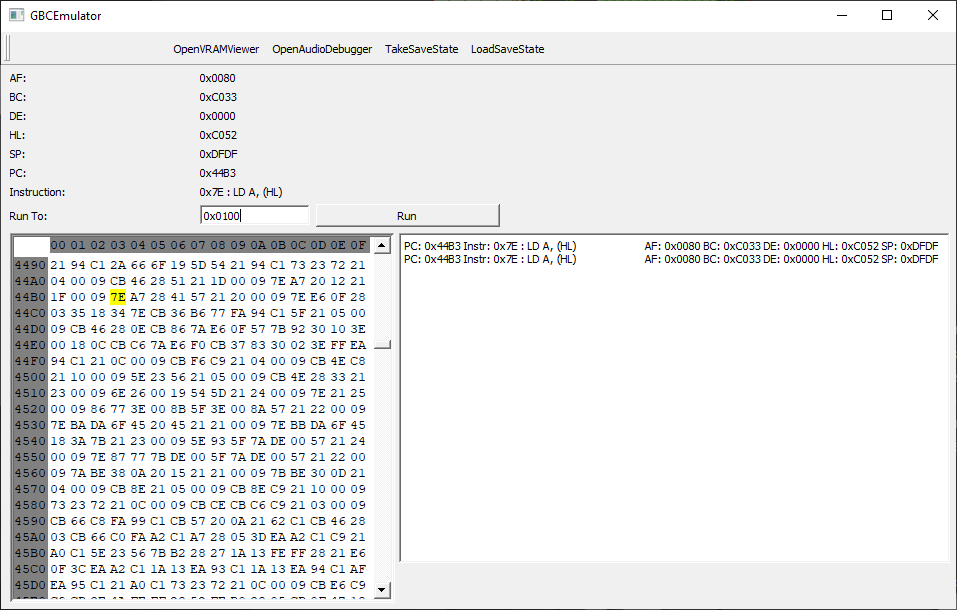
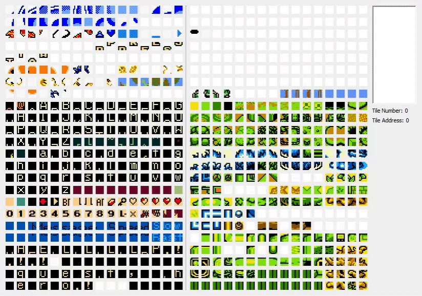
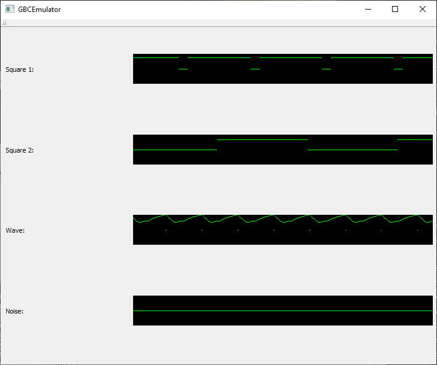

# GBCEmulator

[](https://travis-ci.org/joshgamer474/GBCEmulator)

A WIP Gameboy (Color) emulator written in C++ and packaged in Conan

## Progress

The emulator currently passes all of blargg's cpu instruction tests and runs a decent amount of GB/GBC games.


 
 

The Qt wrap includes variety of interactive GUI debug tools:
* A fully-featured CPU debugger with step in, step over, step out, etc.
* A real-time video RAM (VRAM) viewer
* A real-time audio channel viewer





## Issues

* Some GBC games do not boot up
* Qt wrap needs some improvement

# How to build

## Prerequisites

* [CMake 3.x](https://cmake.org/download/)
* [Python 3.x](https://www.python.org/downloads/)
* pip3
* Conan.io via pip
## Prerequisite Commands

```pip3 install conan --user```

```conan remote add bincrafters https://api.bintray.com/conan/bincrafters/public-conan```

## Building

```git clone https://github.com/joshgamer474/GBCEmulator.git```

```cd GBCEmulator```

```conan install . -if=build --build=outdated -s compiler.cppstd=17```

```conan build . -bf=build```

## Building Qt wrapped GBCEmulator

```git clone https://github.com/joshgamer474/GBCEmulator.git```

```cd GBCEmulator```

```conan export conanfile.py josh/testing```

```cd qt_wrap```

```conan install . -if=build --build=outdated -s compiler.cppstd=17```

```conan build . -bf=build```

## Building Android (Linux env only)

```git clone https://github.com/joshgamer474/GBCEmulator.git```

```cd GBCEmulator```

```conan export . josh/testing```

```mkdir android && cd android```

```conan install GBCEmulator/<version>@josh/testing --build=outdated --profile:host=../profiles/android --profile:build=/home/<username>/.conan/profiles/default -s arch=<desired build arch> -o shared=True -s compiler.cppstd=17```

Now you should have built .so Android library files in android/lib/<desired build arch>

## Creating Installers and Packages

GBCEmulator now includes a packaging system that can generate installers and packages for Windows, macOS, and Linux.

### Prerequisites for Packaging

- CMake 3.23 or higher
- Platform-specific tools:
  - Windows: NSIS (for installer creation)
  - macOS: None (built-in tools are used)
  - Linux: dpkg-deb (for DEB packages), rpmbuild (for RPM packages)

### Building Packages

```bash
# Configure the project
cmake -B build -S .

# Build the project
cmake --build build

# Create packages
cd build
cpack
```

This will create packages appropriate for your current platform:
- Windows: NSIS installer (.exe) and ZIP archive
- macOS: DMG disk image
- Linux: DEB, RPM, and TGZ packages

### Customizing Packages

The packaging system is located in the `packaging/` directory and can be customized by editing the files there. See `packaging/README.md` for more details.

## How to use
Open the built GBCEmulator.exe or GBCEmulator_qt.exe and drag and drop your favorite rom in.


# TODO

## Implement some Core features
- [x] GPU Sprite Rendering
- [x] Input handling using SDL
- [x] Add timing and sleeping to core while() loop so the emulator runs at its proper speed
- [x] Sound
- [x] Controls
- [x] Create a GUI (maybe Qt?)
- [x] Linux build support
- [x] Android build support
- [x] Cross-platform packaging and installers

## Organization
- [x] Implement Conan.io packaging for libraries
- [x] Implement Conan.io package for this repo
- [x] Include CMake building


## Testing

### Core feature testing and correctness
- [ ] Memory Bank Controllers
- [ ] Interrupt handling correctness
- [ ] GPU background rollover testing
- [x] Get a game to actually boot

### Create automated unit testing using GTest
- [x] Implement for blargg's cpu_instrs
- [x] Implement for blargg's dmg_sound
- [x] Implement for blargg's instr_timing
- [x] Implement for blargg's interrupt_time
- [x] Implement for blargg's oam_bug
- [x] Implement for blargg's mem_timing
- [x] Implement for blargg's mem_timing-2
- [x] Implement for blargg's cgb_sound